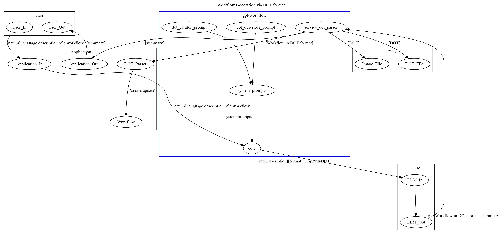
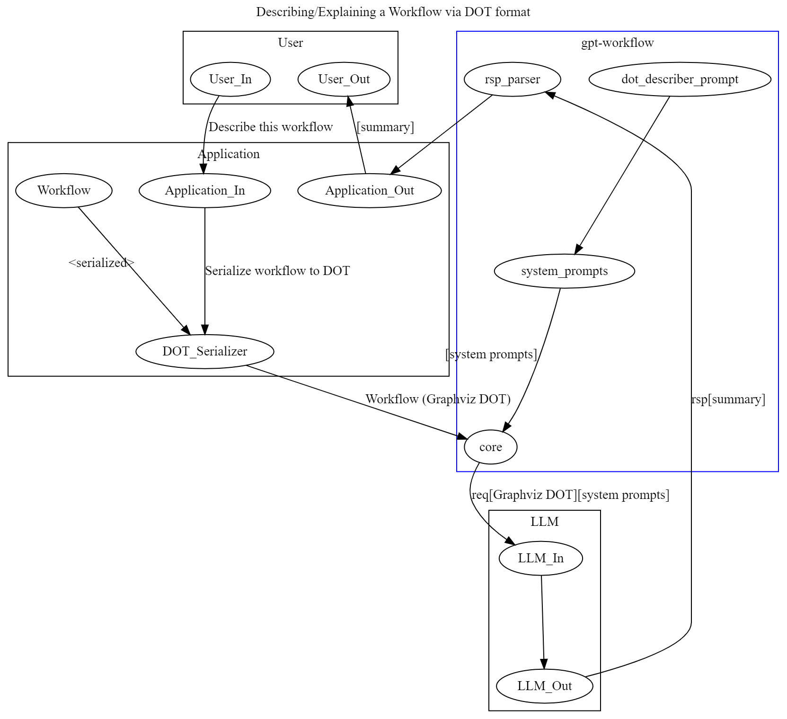
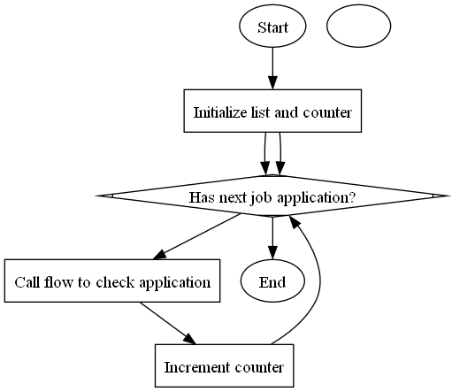
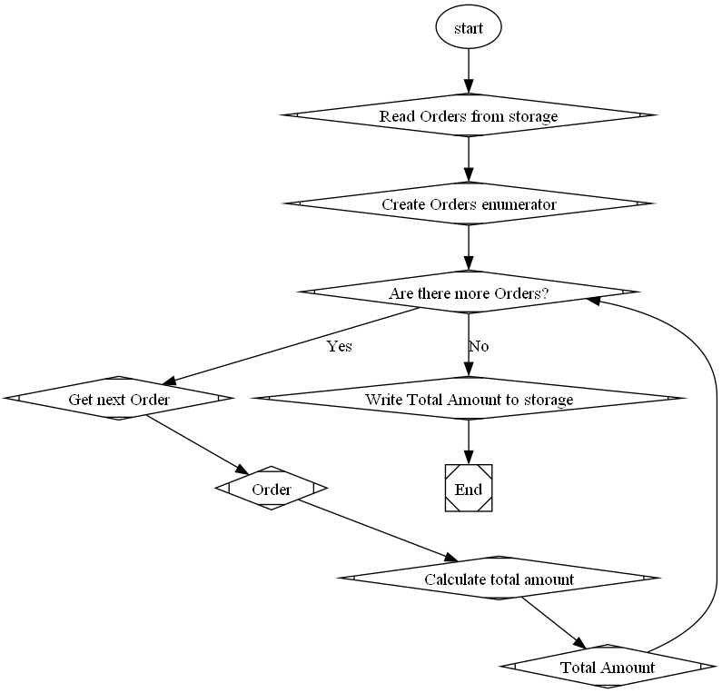

# gpt-workflow
Generate workflows (for flowcharts or low code) in DOT format, from natural language, via an LLM.

Also perform the inverse: describe a given workflow (given in DOT format) in natural language.

## Approach: generate DOT notation as a simple format to represent a workflow

The DOT graph format (as used by tools like graphviz) is a simple way to represent a flow chart. A flow chart is a good approximation of a workflow.

Because DOT graphs are a common public format, large LLMs such as Open AI gpt-3.5-turbo have included them in their training corpus. So, such LLMs are already capable of both generating DOT files and summarizing them back to natural language. We can use such LLMs both to generate workflows from natural language, and the inverse (generating a summary), by using DOT as an intermediate format.

The DOT script generated by the LLM can be further processed, for example by generating a flow chart image OR by populating some kind of workflow system inside an application.

### Approach: Generating a workflow



### Approach: Describing (explaining) a workflow



## Example generated flow charts

| | |
|---|---|
| Workflow to decide on a mortgage application | Workflow to decide on a job interview candidate|

| | |
|---|---|
| Workflow to decide what is this animal | Workflow to add an item to a list|

| | |
|---|---|
| Workflow to combine two lists | Workflow to conditionally add an item to a list|

| | |
|---|---|
| Iiterate over Job Applications in a list. For each Job Application, call another flow that checks if the application should proceed to interview stage. | The step-by-step process of reading the Orders, iterating over them, calculating the total amount, and writing it back to storage. |

## Example Execution - generating flows in DOT format from natural language input

```
>> Create a flow that makes a series of decisions about whether to approve a mortgage application
Writing png to '.\temp\dot_graph_1.png'
digraph G {

  // start
  start [shape=ellipse, label="Start"];
  
  // decision_credit_score
  start -> decision_credit_score;
  decision_credit_score [shape=Mdiamond, label="Credit Score > 700?"];
  
  // decision_income
  decision_credit_score -> decision_income;
  decision_income [shape=Mdiamond, label="Income > $50,000?"];
  
  // decision_employment
  decision_income -> decision_employment;
  decision_employment [shape=Mdiamond, label="Employment > 2 years?"];
  
  // decision_down_payment
  decision_employment -> decision_down_payment;
  decision_down_payment [shape=Mdiamond, label="Down Payment > 20%?"];
  
  // approve
  decision_down_payment -> approve;
  approve [shape=box, label="Approve"];
  
  // reject
  decision_credit_score -> reject;
  reject [shape=box, label="Reject"];
  
  decision_income -> reject;
  decision_employment -> reject;
  decision_down_payment -> reject;
}
```

```
>> Create a flow that makes a series of decisions about whether to recommend a job interview candidate.
Writing png to '.\temp\dot_graph_2.png'
digraph G {

  // start
  start [shape=ellipse, label="Start"];

  // decision_experience
  start -> decision_experience;
  decision_experience [shape=Mdiamond, label="Has relevant experience?"];

  // decision_education
  decision_experience -> decision_education;
  decision_education [shape=Mdiamond, label="Has required education?"];

  // decision_skills
  decision_education -> decision_skills;
  decision_skills [shape=Mdiamond, label="Has necessary skills?"];

  // decision_references
  decision_skills -> decision_references;
  decision_references [shape=Mdiamond, label="Has positive references?"];

  // recommend
  decision_references -> recommend;
  recommend [shape=box, label="Recommend for interview"];

  // reject
  decision_experience -> reject;
  reject [shape=box, label="Reject"];

  decision_education -> reject;
  decision_skills -> reject;
  decision_references -> reject;
}
```

```
>> Create a flow that makes a series of decisions about an animal, to decide what kind of animal is it
Writing png to '.\temp\dot_graph_3.png'
digraph G {

  // start
  start [shape=ellipse, label="Start"];

  // decision_has_feathers
  start -> decision_has_feathers;
  decision_has_feathers [shape=Mdiamond, label="Has feathers?"];

  // decision_can_fly
  decision_has_feathers -> decision_can_fly;
  decision_can_fly [shape=Mdiamond, label="Can fly?"];

  // decision_has_fins
  decision_has_feathers -> decision_has_fins;
  decision_has_fins [shape=Mdiamond, label="Has fins?"];

  // Hawk
  decision_can_fly -> Hawk;
  Hawk [shape=box, label="Hawk"];

  // Penguin
  decision_can_fly -> Penguin;
  Penguin [shape=box, label="Penguin"];

  // Dolphin
  decision_has_fins -> Dolphin;
  Dolphin [shape=box, label="Dolphin"];

  // Bear
  decision_has_fins -> Bear;
  Bear [shape=box, label="Bear"];
}
```

```
>> Create a flow that takes a list and an object. Call another flow to get a boolean result. If the boolean is true, then add the item to the list.
Writing png to '.\temp\dot_graph_6.png'
digraph G {

  // start
  start [shape=ellipse, label="Start"];

  // call_flow
  call_flow [shape=box, label="Call Flow"];

  // decision_boolean
  decision_boolean [shape=diamond, label="Boolean Result?"];

  // add_item
  add_item [shape=box, label="Add Item"];

  // end
  end [shape=ellipse, label="End"];

  // start -> call_flow
  start -> call_flow;

  // call_flow -> decision_boolean
  call_flow -> decision_boolean;

  // decision_boolean -> add_item [label="true"];
  decision_boolean -> add_item [label="true"];

  // decision_boolean -> end [label="false"];
  decision_boolean -> end [label="false"];

  // add_item -> end
  add_item -> end;

  call_flow [shape=box, label="Call Flow"];
}
```

```
>> Create a flow that iterates over Job Applications in a list. For each Job Application, call another flow that checks if the application should proceed to interview stage

digraph G {

  // start
  start [shape=ellipse, label="Start"];

  // initialize
  start -> initialize;
  initialize [shape=box, label="Initialize list and counter"];

  // decision_has_next
  initialize -> decision_has_next;
  decision_has_next [shape=Mdiamond, label="Has next job application?"];

  // action_call_flow
  decision_has_next -> action_call_flow;
  action_call_flow [shape=box, label="Call flow to check application"];

  // increment_counter
  action_call_flow -> increment_counter;
  increment_counter [shape=box, label="Increment counter"];

  // decision_has_next
  increment_counter -> decision_has_next;

  // end
  decision_has_next -> end;
  end [shape=ellipse, label="End"];

  initialize -> decision_has_next;
}
```

## Example Execution - Describing a given workflow

```
>> Descibe this workflow:
digraph G {

  // start
  start [shape=ellipse, label="Start"];

  // decision_credit_score
  start -> decision_credit_score;
  decision_credit_score [shape=Mdiamond, label="Credit Score > 700?"];

  // decision_income
  decision_credit_score -> decision_income;
  decision_income [shape=Mdiamond, label="Income > $50,000?"];

  // decision_employment
  decision_income -> decision_employment;
  decision_employment [shape=Mdiamond, label="Employment > 2 years?"];

  // decision_down_payment
  decision_employment -> decision_down_payment;
  decision_down_payment [shape=Mdiamond, label="Down Payment > 20%?"];

  // approve
  decision_down_payment -> approve;
  approve [shape=box, label="Approve"];

  // reject
  decision_credit_score -> reject;
  reject [shape=box, label="Reject"];

  decision_income -> reject;
  decision_employment -> reject;
  decision_down_payment -> reject;
}

This flow chart represents a decision-making process for approving or rejecting a loan application. 

The process starts at the "Start" node and then moves to the "Credit Score > 700?" decision node. If the credit score is greater than 700, the flow moves to the "Income > $50,000?" decision node. If the income is greater than $50,000, the flow moves to the "Employment > 2 years?" decision node. If the employment is greater than 2 years, the flow moves to the "Down Payment > 20%?" decision node. If the down payment is greater than 20%, the flow reaches the "Approve" node, indicating that the loan application should be approved.

However, if at any point in the process a condition is not met, the flow moves to the "Reject" node, indicating that the loan application should be rejected.

Overall, this flow chart helps guide the decision-making process for loan approval based on various criteria such as credit score, income, employment, and down payment.
```

```
>> Descibe this workflow:
digraph G {

  // start
  start [shape=ellipse, label="Start"];

  // decision_has_feathers
  start -> decision_has_feathers;
  decision_has_feathers [shape=Mdiamond, label="Has feathers?"];

  // decision_can_fly
  decision_has_feathers -> decision_can_fly;
  decision_can_fly [shape=Mdiamond, label="Can fly?"];

  // decision_has_fins
  decision_has_feathers -> decision_has_fins;
  decision_has_fins [shape=Mdiamond, label="Has fins?"];

  // Hawk
  decision_can_fly -> Hawk;
  Hawk [shape=box, label="Hawk"];

  // Penguin
  decision_can_fly -> Penguin;
  Penguin [shape=box, label="Penguin"];

  // Dolphin
  decision_has_fins -> Dolphin;
  Dolphin [shape=box, label="Dolphin"];

  // Bear
  decision_has_fins -> Bear;
  Bear [shape=box, label="Bear"];
}

This flow chart represents a decision-making process to determine the characteristics of different animals based on whether they have feathers, can fly, or have fins.

The process starts at the "Start" node and then moves to the "Has feathers?" decision node. If the animal has feathers, the flow moves to the "Can fly?" decision node. If the animal can fly, the flow reaches the "Hawk" node, indicating that the animal is a hawk. However, if the animal cannot fly, the flow reaches the "Penguin" node, indicating that the animal is a penguin.

If the animal does not have feathers, the flow moves to the "Has fins?" decision node. If the animal has fins, the flow reaches the "Dolphin" node, indicating that the animal is a dolphin. However, if the animal does not have fins, the flow reaches the "Bear" node, indicating that the animal is a bear.

Overall, this flow chart helps classify animals based on their characteristics, specifically whether they have feathers, can fly, or have fins
```

## Example Execution - Handling irrelevant prompts

```
---
>> what is 2 + 5 divided by 10 ?
I'm sorry, but I can only assist with questions related to creating a flow chart.
---
>> Who won the battle of Agincourt, and why was it fought?
I'm sorry, but I can only assist with questions related to creating a flow chart.
---
>> What is my favourite color?
I'm sorry, but I don't have access to personal information.
```

## Dependencies

- Requires an LLM - by default, uses OpenAI's ChatGPT.
- Python 3
- [graphviz](https://www.graphviz.org/#download)

## Usage

To use as a CLI (Command Line Interface) REPL (Read-Eval-Print Loop) prompt:
```go.sh```

or to use as a web server:

```go_web.sh```

For the web server, you need to pass the user prompt as GET query parameter 'p'.

Example:

- http://localhost:8083/?p=I%20need%20a%20make%20a%20Car%20Parts%20application

So, another application can use the web server to send in natural language prompts from the user, and receive response in the graphviz DOT format.

The other application can then generate an image or some kind of workflow, from the DOT script.

## Set up

```
pip3 install --upgrade openai pydot
```

Set environment variable with your OpenAI key:

```
export OPENAI_API_KEY="xxx"
```

Add that to your shell initializing script (`~/.zprofile` or similar)

Load in current terminal:

```
source ~/.zprofile
```

## Test

`test.sh`

or

`python test.py`

## Related Tools

[graphviz online editor](https://dreampuf.github.io/GraphvizOnline)
