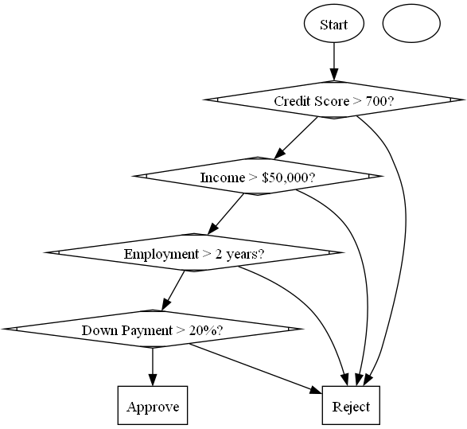
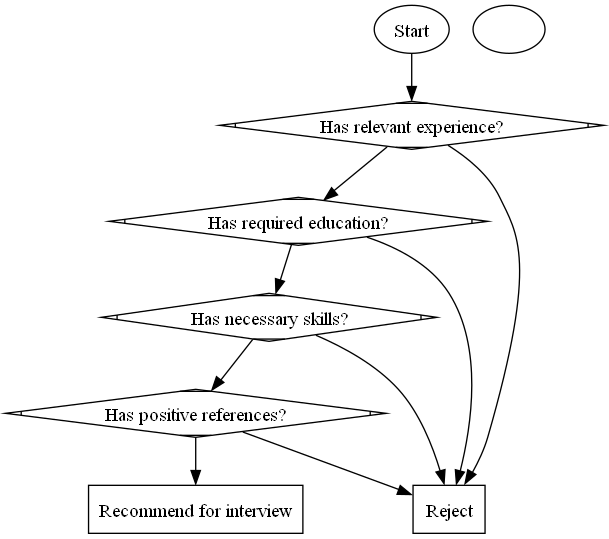
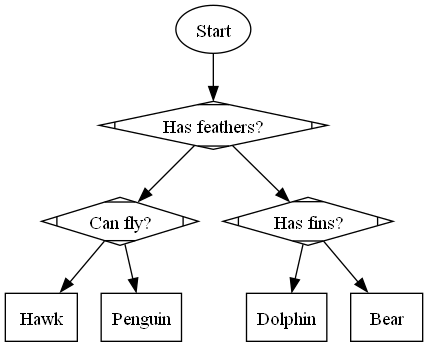
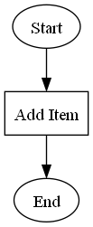
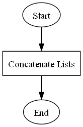
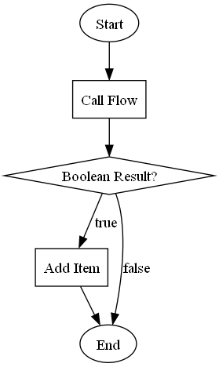

# gpt-workflow
Generate workflows (for flowcharts or low code) via LLM.

## Approach: generate DOT notation as a simple format to represent a workflow

The DOT graph format (as used by tools like graphviz) is a simple way to represent a flow chart.
The DOT script generated by the LLM can be further processed, for example by generating a flow chart image OR by populating some kind of workflow system.

## Example generated flow charts

| | |
|---|---|
| Workflow to decide on a mortgage application | Workflow to decide on a job interview candidate|

| | |
|---|---|
| Workflow to decide what is this animal | Workflow to add an item to a list|

| | |
|---|---|
| Workflow to combine two lists | Workflow to conditionally add an item to a list|

## Example Execution - generating flows in DOT format from natural language input

```
[[[TEST Simple workflow to model a tree of decisions]]]
---
>> Create a flow that makes a series of decisions about whether to approve a mortgage application
Writing png to '.\temp\dot_graph_1.png'
digraph G {

  // start
  start [shape=ellipse, label="Start"];
  
  // decision_credit_score
  start -> decision_credit_score;
  decision_credit_score [shape=Mdiamond, label="Credit Score > 700?"];
  
  // decision_income
  decision_credit_score -> decision_income;
  decision_income [shape=Mdiamond, label="Income > $50,000?"];
  
  // decision_employment
  decision_income -> decision_employment;
  decision_employment [shape=Mdiamond, label="Employment > 2 years?"];
  
  // decision_down_payment
  decision_employment -> decision_down_payment;
  decision_down_payment [shape=Mdiamond, label="Down Payment > 20%?"];
  
  // approve
  decision_down_payment -> approve;
  approve [shape=box, label="Approve"];
  
  // reject
  decision_credit_score -> reject;
  reject [shape=box, label="Reject"];
  
  decision_income -> reject;
  decision_employment -> reject;
  decision_down_payment -> reject;
}
---
>> Create a flow that makes a series of decisions about whether to recommend a job interview candidate.
Writing png to '.\temp\dot_graph_2.png'
digraph G {

  // start
  start [shape=ellipse, label="Start"];

  // decision_experience
  start -> decision_experience;
  decision_experience [shape=Mdiamond, label="Has relevant experience?"];

  // decision_education
  decision_experience -> decision_education;
  decision_education [shape=Mdiamond, label="Has required education?"];

  // decision_skills
  decision_education -> decision_skills;
  decision_skills [shape=Mdiamond, label="Has necessary skills?"];

  // decision_references
  decision_skills -> decision_references;
  decision_references [shape=Mdiamond, label="Has positive references?"];

  // recommend
  decision_references -> recommend;
  recommend [shape=box, label="Recommend for interview"];

  // reject
  decision_experience -> reject;
  reject [shape=box, label="Reject"];

  decision_education -> reject;
  decision_skills -> reject;
  decision_references -> reject;
}
---
>> Create a flow that makes a series of decisions about an animal, to decide what kind of animal is it
Writing png to '.\temp\dot_graph_3.png'
digraph G {

  // start
  start [shape=ellipse, label="Start"];

  // decision_has_feathers
  start -> decision_has_feathers;
  decision_has_feathers [shape=Mdiamond, label="Has feathers?"];

  // decision_can_fly
  decision_has_feathers -> decision_can_fly;
  decision_can_fly [shape=Mdiamond, label="Can fly?"];

  // decision_has_fins
  decision_has_feathers -> decision_has_fins;
  decision_has_fins [shape=Mdiamond, label="Has fins?"];

  // Hawk
  decision_can_fly -> Hawk;
  Hawk [shape=box, label="Hawk"];

  // Penguin
  decision_can_fly -> Penguin;
  Penguin [shape=box, label="Penguin"];

  // Dolphin
  decision_has_fins -> Dolphin;
  Dolphin [shape=box, label="Dolphin"];

  // Bear
  decision_has_fins -> Bear;
  Bear [shape=box, label="Bear"];
}
[[[TEST Simple workflow adding an item to a list]]]
---
>> Create a flow that takes a list and adds an item of the same type
Writing png to '.\temp\dot_graph_4.png'
digraph G {

  // start
  start [shape=ellipse, label="Start"];

  // add_item
  add_item [shape=box, label="Add Item"];

  // end
  end [shape=ellipse, label="End"];

  // start -> add_item
  start -> add_item;

  // add_item -> end
  add_item -> end;

  add_item [shape=box, label="Add Item"];
}
---
>> Create a flow that takes two lists and concatenates them
Writing png to '.\temp\dot_graph_5.png'
digraph G {

  // start
  start [shape=ellipse, label="Start"];

  // concatenate_lists
  concatenate_lists [shape=box, label="Concatenate Lists"];

  // end
  end [shape=ellipse, label="End"];

  // start -> concatenate_lists
  start -> concatenate_lists;

  // concatenate_lists -> end
  concatenate_lists -> end;

  concatenate_lists [shape=box, label="Concatenate Lists"];
}
---
>> Create a flow that takes a list and an object. Call another flow to get a boolean result. If the boolean is true, then add the item to the list.
Writing png to '.\temp\dot_graph_6.png'
digraph G {

  // start
  start [shape=ellipse, label="Start"];

  // call_flow
  call_flow [shape=box, label="Call Flow"];

  // decision_boolean
  decision_boolean [shape=diamond, label="Boolean Result?"];

  // add_item
  add_item [shape=box, label="Add Item"];

  // end
  end [shape=ellipse, label="End"];

  // start -> call_flow
  start -> call_flow;

  // call_flow -> decision_boolean
  call_flow -> decision_boolean;

  // decision_boolean -> add_item [label="true"];
  decision_boolean -> add_item [label="true"];

  // decision_boolean -> end [label="false"];
  decision_boolean -> end [label="false"];

  // add_item -> end
  add_item -> end;

  call_flow [shape=box, label="Call Flow"];
}
[[[TEST Irrelevant prompts]]]
---
>> what is 2 + 5 divided by 10 ?
I'm sorry, but I can only assist with questions related to creating a flow chart.
---
>> Who won the battle of Agincourt, and why was it fought?
I'm sorry, but I can only assist with questions related to creating a flow chart.
---
>> What is my favourite color?
I'm sorry, but I don't have access to personal information.
```

## Dependencies

- Requires an LLM - by default, uses OpenAI's ChatGPT.
- Python 3
- [graphviz](https://www.graphviz.org/#download)

## Usage

To use as a CLI (Command Line Interface) REPL (Read-Eval-Print Loop) prompt:
```go.sh```

or to use as a web server:

```go_web.sh```

For the web server, you need to pass the user prompt as GET query parameter 'p'.

Example:

- http://localhost:8083/?p=I%20need%20a%20make%20a%20Car%20Parts%20application

So, another application can use the web server to send in natural language prompts from the user, and receive response in the graphviz DOT format.

The other application can then generate an image or some kind of workflow, from the DOT script.

## Set up

```
pip3 install --upgrade openai pydot
```

Set environment variable with your OpenAI key:

```
export OPENAI_API_KEY="xxx"
```

Add that to your shell initializing script (`~/.zprofile` or similar)

Load in current terminal:

```
source ~/.zprofile
```

## Test

`test.sh`

or

`python test.py`
